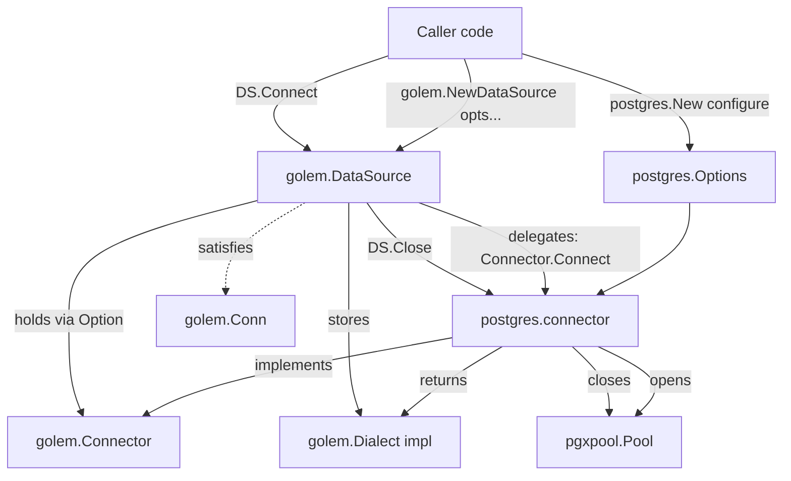

# Foundation (M1) Design

**Spec**: `.specs/features/foundation/spec.md`
**Status**: Draft

---

## Architecture Overview

`golem.DataSource` is a thin lifecycle/holder object. It never knows about SQL syntax or driver
details itself — it delegates connection establishment to a pluggable `Connector` (implemented by
each adapter package, starting with `postgres`) and, once connected, holds the `Dialect` that
connector produces. `Dialect` is the only thing that knows how to translate `golem.ColumnType`
values to/from driver values; in M1 it exists purely as a contract + a Postgres implementation with
no real callers yet (M2+ are the first callers).

`golem.Conn` is a sealed marker interface (unexported method) satisfied today only by
`*golem.DataSource`. It exists now so M3 (`repository.Get`), M8 (`golem.Tx`), and M9 (`Exec`) can be
written against the interface from day one — but it stays empty of real methods in M1 per spec
FOUND-11 ("no speculative methods"). Sealing (unexported method) also prevents adapters/users from
accidentally satisfying `Conn` with an unrelated type, keeping the "who can be a Conn" question
answered by this package alone, same reasoning as AD-016's "only adapters inside the module tree can
implement Dialect".



---

## Code Reuse Analysis

### Existing Components to Leverage

| Component | Location | How to Use |
| --- | --- | --- |
| `pgx/v5` | already in `go.mod` (`github.com/jackc/pgx/v5`) | Use `pgxpool` (add `github.com/jackc/pgx/v5/pgxpool` — same module, no new dependency root) for the connection pool inside `driver/postgres` |

Nothing else pre-exists in this repo (golem's own code was previously wiped per user context) — this is the first code written.

### Integration Points

| System | Integration Method |
| --- | --- |
| Postgres | `driver/postgres` connector opens a `pgxpool.Pool` from a DSN string; `SELECT 1` used as the independent-test smoke check |

---

## Components

### `golem` (root package) — `DataSource` + `Conn`

- **Purpose**: Own the connect/close lifecycle and hold the active `Dialect` + name for a logical database connection.
- **Location**: `datasource.go`, `options.go`
- **Interfaces**:
  - `NewDataSource(opts ...Option) (*DataSource, error)` — builds config from options; errors if no `Connector` option was supplied (FOUND requires *some* connector, `postgres.New(...)` in practice)
  - `DataSourceName(name string) Option` — sets the name; default `"default"` when omitted
  - `WithConnector(c Connector) Option` — exported so adapter packages (`postgres.New`, future `mysql.New`, ...) can plug in without `golem` knowing about them; not meant to be called directly by end users (README never calls it — `postgres.New` calls it internally)
  - `(*DataSource) Connect() error` — delegates to the configured `Connector.Connect()`; idempotent (second call on an already-connected `DataSource` is a no-op, returns nil) — see Tech Decisions
  - `(*DataSource) Close() error` — delegates to `Connector.Close()`; safe no-op if never connected; idempotent if called twice
  - `(*DataSource) Name() string` — returns the configured/default name
- **Dependencies**: `Connector` (below), `Logger`/`LogLevel`
- **Reuses**: nothing yet (first component)

### `golem` (root package) — `Conn`

- **Purpose**: Sealed marker interface; hard prerequisite for M3/M8/M9 signatures, intentionally empty of behavior in M1.
- **Location**: `conn.go`
- **Interfaces**:
  - `type Conn interface { isConn() }` — unexported method
  - `(*DataSource) isConn() {}` — satisfies it
  - `var _ Conn = (*DataSource)(nil)` compile-time assertion (FOUND-10)
- **Dependencies**: none
- **Reuses**: none

### `golem` (root package) — `Dialect` + `Connector` contracts

- **Purpose**: Define what an adapter must implement: value bind/scan (`Dialect`) and connection lifecycle (`Connector`, produces a `Dialect` once connected).
- **Location**: `dialect.go`, `connector.go`
- **Interfaces**:
  - `type Dialect interface { Bind(t ColumnType, value any) (driver.Value, error); Scan(t ColumnType, raw any, dest any) error }` (`driver` = `database/sql/driver`)
  - `type Connector interface { Connect() (Dialect, error); Close() error }`
- **Dependencies**: `ColumnType`
- **Reuses**: none

### `golem` (root package) — `ColumnType` (M1 stub only)

- **Purpose**: Exist as an opaque semantic-type identifier so `Dialect.Bind`/`Scan` have a real parameter type to compile against. The actual constructors (`golem.BIGINT()`, `golem.VARCHAR(n)`, ...) are M2 — out of scope here.
- **Location**: `columntype.go`
- **Interfaces**:
  - `type ColumnType struct { kind string }` — unexported field; no exported constructor in M1 (M2 adds `BIGINT()`, `VARCHAR(int)`, etc., which all just set `kind`)
  - Package-internal tests construct it directly (`ColumnType{kind: "test"}`) since they're in-package — satisfies the spec's "minimal fake `ColumnType`" independent test without inventing public API ahead of M2
- **Dependencies**: none
- **Reuses**: none

### `golem` (root package) — `Logger` + `LogLevel`

- **Purpose**: Pluggable lifecycle-event logging; default console logger when none supplied.
- **Location**: `logger.go`
- **Interfaces**:
  - `type LogLevel int` with `LogLevelDebug/Info/Warn/Error` consts + `(LogLevel) String() string`
  - `type Logger interface { Debug(msg string, args map[string]any); Info(...); Warn(...); Error(...) }`
  - `defaultLogger` (unexported): `fmt.Println`-based, used when `Options.Logger` is nil
- **Dependencies**: none
- **Reuses**: none

### `driver/postgres` — `Options` + `New`

- **Purpose**: User-facing configuration entrypoint; builds a `golem.Option` wrapping a `Connector`.
- **Location**: `driver/postgres/postgres.go`
- **Interfaces**:
  - `type Options struct { DSN string; Host string; Port int; User string; Password string; Database string; SSLMode string; Logging bool; Logger golem.Logger }`
  - `func New(configure func(*Options)) golem.Option`
- **Dependencies**: `golem.WithConnector`, `golem.Logger`
- **Reuses**: `golem.Option`/`golem.WithConnector` seam

### `driver/postgres` — DSN precedence resolution

- **Purpose**: Combine `DSN` + discrete fields into one final connection string, discrete fields winning per-field.
- **Location**: `driver/postgres/dsn.go`
- **Interfaces**:
  - `func resolveDSN(o *Options) (string, error)` — parses `o.DSN` with `net/url` (Postgres DSNs are valid URLs), overrides `User`/`Host`/`Port`/path (db name)/`sslmode` query param only for fields that are non-zero in `o`; if `o.DSN == ""` and no discrete field set, returns an error; if `o.DSN == ""` but discrete fields are set, builds the DSN from scratch
- **Dependencies**: `net/url`
- **Reuses**: none

### `driver/postgres` — `connector` (implements `golem.Connector`)

- **Purpose**: Own the `pgxpool.Pool` lifecycle; the thing `DataSource.Connect()`/`Close()` actually delegate to.
- **Location**: `driver/postgres/connector.go`
- **Interfaces**:
  - `(*connector) Connect() (golem.Dialect, error)` — resolves DSN, opens `pgxpool.New`, runs `SELECT 1` as a liveness check, wraps unreachable-host/bad-auth errors descriptively (never panics), logs via `Options.Logger`/default logger when `Options.Logging`
  - `(*connector) Close() error` — closes the pool; safe no-op if pool is nil
- **Dependencies**: `github.com/jackc/pgx/v5/pgxpool`
- **Reuses**: `resolveDSN`

### `driver/postgres` — `dialect` (implements `golem.Dialect`)

- **Purpose**: M1 stub implementation — exists and compiles against the contract; `Bind`/`Scan` return a descriptive "unrecognized ColumnType" error for anything (no real `ColumnType` values exist to bind/scan until M2).
- **Location**: `driver/postgres/dialect.go`
- **Interfaces**:
  - `(*dialect) Bind(t golem.ColumnType, value any) (driver.Value, error)`
  - `(*dialect) Scan(t golem.ColumnType, raw any, dest any) error`
  - `var _ golem.Dialect = (*dialect)(nil)` (FOUND-17)
- **Dependencies**: `database/sql/driver`
- **Reuses**: none

---

## Data Models

### `postgres.Options`

```go
type Options struct {
    DSN      string
    Host     string
    Port     int
    User     string
    Password string
    Database string
    SSLMode  string
    Logging  bool
    Logger   golem.Logger
}
```

**Relationships**: consumed by `postgres.New` to build the `connector`; `resolveDSN` reads every field except `Logging`/`Logger`.

### `golem.ColumnType` (M1 stub)

```go
type ColumnType struct {
    kind string // unexported; M2 adds exported constructors (BIGINT(), VARCHAR(n), ...) that set this
}
```

**Relationships**: parameter type on `Dialect.Bind`/`Scan`. No relationship to any other M1 type.

---

## Error Handling Strategy

| Error Scenario | Handling | User Impact |
| --- | --- | --- |
| Malformed DSN (invalid URL syntax) | `resolveDSN` returns descriptive error before ever touching the network; `connector.Connect` propagates it | `Connect()` returns non-nil error, no panic |
| No DSN and no discrete fields set | `resolveDSN` returns a configuration error | `Connect()` returns non-nil error, no panic (FOUND-09) |
| Unreachable host / connection refused | `pgxpool.New` (or the first ping) fails; wrapped with context (`"golem/postgres: connect: %w"`) | `Connect()` returns non-nil, descriptive error |
| Auth rejected (bad user/password) | Same path as unreachable host — pgx surfaces it as a connection error | `Connect()` returns non-nil, descriptive error, does not hang |
| `Connect()` called twice on an already-connected `DataSource` | `DataSource` tracks a `connected bool`; second call short-circuits, returns nil | Idempotent no-op (see Tech Decisions) |
| `Close()` called without a prior `Connect()` | `DataSource.Close()` checks `connected`; no-op, returns nil | Safe no-op, no panic |
| `Close()` called twice | `Connector.Close()` (pgx pool `Close()`) is itself idempotent in pgx; `DataSource` also guards via `connected = false` after first close | No panic |
| `Dialect.Bind`/`Scan` called with an unrecognized `ColumnType` | Returns `fmt.Errorf("golem/postgres: unrecognized column type %q", ...)` | Descriptive error, no panic (FOUND-19) |

---

## Tech Decisions (only non-obvious ones)

| Decision | Choice | Rationale |
| --- | --- | --- |
| `Connect()` on an already-connected `DataSource` | Idempotent no-op (returns nil) | Spec left this TBD; no-op matches most Go pool-based libraries (`database/sql` itself lazily connects and tolerates repeat calls) and is less surprising than forcing callers to track connection state themselves |
| `Close()` without prior `Connect()` | Safe no-op (returns nil) | Same reasoning — avoids forcing defensive `if connected` checks in caller code, matches `defer dataSource.Close()` being used unconditionally in every README example |
| `golem.Conn` shape in M1 | Unexported sealing method (`isConn()`), no real methods | Spec explicitly forbids speculative methods (FOUND-11); an empty exported interface would let any type satisfy it accidentally, sealing keeps "who can be a Conn" decided only by this package, consistent with the adapter-sealing reasoning already used for `Dialect` (AD-016) |
| Adapter integration seam | `golem.WithConnector(Connector) Option` (exported but not meant for direct end-user use) + `Connector` interface (`Connect() (Dialect, error)`, `Close() error`) | README shows `postgres.New(...)` passed directly into `golem.NewDataSource(...)` alongside `golem.DataSourceName(...)` — both must return the same `golem.Option` type, so `postgres.New` needs a public seam into `golem`'s option system without `golem` importing `postgres` (would be a cycle) |
| `ColumnType` representation in M1 | Unexported struct field (`kind string`), no exported constructor yet | Keeps the public surface at zero until M2 decides the real type set (AD-015 todo); package-internal tests can still construct fakes directly since Go tests share package visibility |
| DSN parsing | `net/url.Parse` on the `postgres://...` DSN, override only fields the caller actually set on `Options` | Postgres DSNs are valid URLs, so `net/url` avoids hand-rolled parsing; "only override set fields" implements the documented precedence rule (discrete fields win, partial override) without extra config |
| Postgres pool driver | `github.com/jackc/pgx/v5/pgxpool` | Already the vendored dependency in `go.mod` (`pgx/v5`); `pgxpool` is its blessed pooling layer, no new dependency to add |

---

## Tips applied

- Sealed `Conn` avoids speculative surface while still existing for M3/M8/M9 to build against.
- `Connector`/`Dialect` split mirrors AD-016's later `Dialect` growth: `Connector` is lifecycle-only, `Dialect` is value/statement-only — clean separation before `Dialect` grows `CompileSelect`/`Insert`/etc. in M3+.
- No new dependency introduced beyond what `go.mod` already has (`pgx/v5`).


