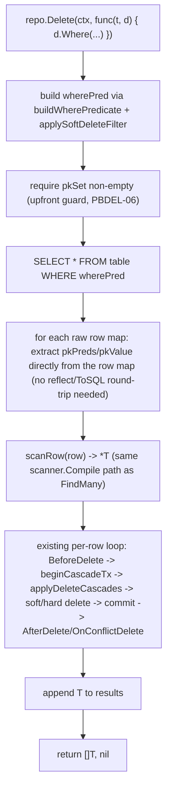

# Predicate-Based Delete (M25) Design

**Spec**: `.specs/features/predicate-based-delete/spec.md`
**Status**: Draft

---

## Architecture Overview

`Repository[T].Delete` changes from "the caller supplies fully-formed `*T` instances" to "the caller
supplies a `Where` predicate, `Repository[T]` finds the matching rows itself." This mirrors
`Update`'s existing shape almost exactly, with one structural difference: `Update`'s dialect method
(`Dialect.Update`) does the filter+mutate+return-changed-rows in a single round-trip via SQL
`RETURNING`/`OUTPUT`/equivalent. `Delete` cannot do that, because — unlike `Update` — it must run
**per-row** side effects (`BeforeDelete` hook, `OnDelete` cascade check) **before** the row is
actually removed, and those need a real `*T` and a real PK value in hand up front. So `Delete`'s new
flow is: **SELECT matching rows first, then reuse the exact per-row loop that already exists today**
(hook → cascade → delete-or-soft-delete → hook/conflict-hook), just fed by SELECT results instead of
caller-supplied pointers.



This is a genuinely smaller change than it looks: the per-row body (repository.go:754-841 today) is
almost entirely reused verbatim. What changes is (1) where the loop's `item`/`pkPreds`/`pkValue` come
from, and (2) the public signature + the new `query.Delete[T]` builder type.

---

## Components

### `query.Delete[T]` (new type, `internal/query/query.go`)

Mirrors `Count[T]`'s shape exactly (`Where` + `WithDeleted`, no `Set` — `Delete` never sets column
values):

```go
// Delete is received by a Delete criteria callback.
type Delete[T any] struct {
	conditions  []op.Condition
	withDeleted bool
}

func NewDelete[T any]() *Delete[T] { return &Delete[T]{} }

func (d *Delete[T]) Where(conditions ...op.Condition) *Delete[T] {
	d.conditions = append(d.conditions, conditions...)
	return d
}

func (d *Delete[T]) WithDeleted() *Delete[T] {
	d.withDeleted = true
	return d
}

func (d *Delete[T]) Conditions() []op.Condition { return d.conditions }
func (d *Delete[T]) IsWithDeleted() bool         { return d.withDeleted }
```

Exported from `golem.go` as `golem.Delete[T]` (type alias, same pattern every other `query.X[T]`
already follows — `golem.Query[T]`, `golem.Update[T]`, `golem.Count[T]`).

### `Repository[T].Delete` (rewritten, `internal/repository/repository.go:746`)

**New signature:**

```go
func (r *Repository[T]) Delete(ctx context.Context, criteria func(t *T, d *query.Delete[T])) ([]T, error)
```

**New body, replacing the current `for _, item := range items` loop's setup:**

1. `var zero T; d := query.NewDelete[T](); criteria(&zero, d)`
2. `pkSet := r.pkColumnSet(); f2c := r.fieldToColumn()`
3. **Upfront PK guard (PBDEL-06):** `if len(pkSet) == 0 { return nil, fmt.Errorf(...) }` — moved out
   of the per-item loop (today it's checked per item after failing to build `pkPreds`; now it's a
   property of the entity, checked once, before doing any I/O).
4. `wherePred, err := r.buildWherePredicate(&zero, f2c, r.meta.TableName, d.Conditions())`
5. `wherePred = r.applySoftDeleteFilter(r.meta.TableName, r.meta.DeleteDateField, d.IsWithDeleted(), wherePred)`
6. Run the match SELECT: `selPlan := &stmt.Select{Table: r.meta.TableName, Where: wherePred}` →
   `sql, args, err := r.conn.Dialect().CompileSelect(selPlan)` → `rows, err :=
   r.conn.Dialect().Query(ctx, r.conn, sql, args)`. This is the exact same
   `CompileSelect`+`Query` pairing `applyDeleteCascades` already uses today (repository.go:665-673)
   for its own restrict-check SELECT — no new `Dialect` method needed.
7. `if len(rows) == 0 { return nil, nil }` (PBDEL-02 — zero matches is not an error, same as `Update`).
8. `fkRegs := entity.ForeignKeysReferencing(r.meta.TableName)` (unchanged, hoisted above the loop
   exactly like today).
9. **For each `row := range rows`** (this replaces `for _, item := range items`):
   - Build `pkPreds`/`pkValue` **directly from `row[col.Name]`** for every `col` where
     `pkSet[col.Name]` — no `reflect.ValueOf`/`Parser().ToSQL()` round-trip needed here, since `row`'s
     values already came straight out of the database in driver-ready form (this is strictly less
     work than today's version, which converts a live Go struct field into a `driver.Value`).
   - `item, err := r.scanRow(row)` — same `scanner.Compile`-based path `FindMany` already uses,
     giving `BeforeDelete`/`AfterDelete`/`OnConflictDelete` a fully-populated `*T`, not a
     PK-only stub (PBDEL-04).
   - The rest of the loop body — `TriggerBeforeDelete` → `beginCascadeTx` → `applyDeleteCascades` →
     soft-delete `Update` or hard `CompileDelete`+`Exec` → commit/rollback →
     `TriggerOnConflictDelete`/`TriggerAfterDelete` — is **copied unchanged** from today's
     implementation (repository.go:755-841), just reading `pkPreds`/`pkValue`/`&item` from the new
     source instead of the old `item`/its reflected fields.
   - `results = append(results, item)`.
10. `return results, nil`.

**What's explicitly NOT changing:** `beginCascadeTx`, `applyDeleteCascades`, `cascadeActionable` —
all untouched, still operate on a single `pkValue` per call exactly as today.

### `golem.go` reexport

- `type Delete[T any] = query.Delete[T]` added alongside the existing `Query[T]`/`Update[T]`/`Count[T]` aliases.

### Unbounded-predicate note (spec's Edge Case / AC-4 under P1 story 1)

Calling `repo.Delete(ctx, func(t *T, d *golem.Delete[T]) {})` with no `.Where(...)` at all now
matches (and deletes/soft-deletes) every row in the table — identical semantics to calling
`repo.Update(ctx, func(t *T, u *golem.Update[T]) { u.Set(...) })` with no `Where` today, which already
updates every row. This is a **consistency choice, not an oversight**: `Delete` becoming the one
predicate-shaped write path that secretly still required a non-empty filter would be a surprising,
undocumented special case. No new guard is added — same as `Update` never got one.

---

## Data Flow: `Delete`

```
criteria(&zero, d)
  -> wherePred (buildWherePredicate + applySoftDeleteFilter)
  -> CompileSelect + Query  -> []map[string]any (raw matched rows)
  -> for each raw row:
       pkPreds/pkValue extracted directly from the row map
       item := scanRow(row)
       BeforeDelete(item)
       beginCascadeTx / applyDeleteCascades(pkValue)
       DeleteDate set (soft) OR CompileDelete+Exec (hard), keyed by pkPreds
       commit
       AfterDelete(item) / OnConflictDelete(item) on conflict
       results = append(results, item)
  -> return results, nil
```

---

## Tech Decisions

| Decision                                                          | Choice                                                                 | Rationale                                                                                                                                                                    |
| ------------------------------------------------------------------ | ------------------------------------------------------------------------ | -------------------------------------------------------------------------------------------------------------------------------------------------------------------------- |
| SELECT-then-loop, not a single bulk `DELETE ... WHERE`             | Keep the existing per-row loop, feed it from a SELECT                    | Hooks (`BeforeDelete`/`OnConflictDelete`/`AfterDelete`) and `OnDelete` cascade (M11) both require a real `*T`/`pkValue` per row, decided *before* the row is removed — a bulk statement can't provide either without giving those up |
| `query.Delete[T]` mirrors `Count[T]`, not `Update[T]`               | `Where`/`WithDeleted` only, no `Set`                                    | `Delete` never assigns column values — a `Set` method would be dead API surface                                                                                             |
| Return `([]T, error)`, not `(int64, error)`                        | Return the deleted rows themselves                                       | Matches `Update`'s return shape exactly, and the rows are already fully scanned in-memory as part of the SELECT-then-loop flow — returning just a count would throw that away for free |
| Zero matches → `(nil, nil)`, not `golem.ErrNotFound`                | No error on empty match set                                              | Matches `Update`'s existing "zero rows affected is not an error" precedent (AD-031) — `Delete` becoming the one criteria-based write path that errors on empty match would be inconsistent |
| No new `Dialect` method                                            | Reuse `CompileSelect`+`Query`, already used by `applyDeleteCascades`     | Every adapter already implements this pair; adding a new `Dialect.SelectForDelete`-style method would be pure duplication for zero new capability                          |
| PK-presence guard moves from per-item to upfront                   | One check before the SELECT, using `pkColumnSet()`                       | The old per-item check was actually checking a property of the *entity* (does it have a PK declared), not of the *item* — checking it once, before any I/O, is strictly better and was only per-item before because the old signature had no "before any items" moment |
| `pkPreds`/`pkValue` sourced from the SELECT's raw row map, not `reflect`+`Parser().ToSQL()` | Read `row[col.Name]` directly                       | The old code needed `Parser().ToSQL()` because it started from a live Go struct field of unknown provenance (caller-constructed). The new code starts from a value that already round-tripped through the exact same dialect/driver on the way out of the SELECT — reusing it directly is strictly simpler and removes a redundant conversion, not a shortcut |

---

## Breaking Change / Migration

This is a breaking signature change to `Repository[T].Delete`, the same category of change already
accepted for M23 (AD-057, `golem.Conn`/`golem.NewTx`) and M24 (AD-058, import paths) — the project's
established stance (STATE.md, `v0.{N}.{patch}` scheme, AD-056) is to take breaking changes freely
pre-v1 rather than carry compatibility shims.

**Call sites that must change** (enumerated so tasks.md can assign them, not because any of this is
new information beyond a grep):

- `internal/repository/repository.go`: the `Delete` method itself, plus its two internal callers
  inside the same file if any exist (none found — `Restore`/`SaveOne`/etc. don't call `Delete`).
- `internal/repository/repository_test.go`: every `TestRepository_Delete_*` test (≈25 tests found via
  grep) — each currently calls `repo.Delete(ctx, &instance)` and must move to
  `repo.Delete(ctx, func(t *X, d *query.Delete[X]) { d.Where(op.Eq(&t.ID, instance.ID)) })` or
  equivalent. Some of these tests exist specifically to prove hook/cascade/error-path behavior and
  need their fixtures re-checked (not just mechanically translated) to confirm they still exercise
  the same scenario under the new call shape.
- `README.md`: `Delete(ctx, entities ...*T) error` reference row (line ~787) and the 2 narrative
  examples calling `users.Delete(ctx, &found)` (lines ~752, ~928).
- `docs/guides/repository.md`: same reference table row as README's.
- `.examples/{postgres,mysql,mssql,oracle,sqlite}/main.go` + their `*_integration_test.go`: every
  `repo.Delete(ctx, &x)`-shaped call (`TestBlogExample_DeleteCountAndExists`,
  `TestBlogExample_CascadeDeleteUser_DeletesTheirPosts`, and any narrative `main.go` usage).
- `internal/dialecttest/*.go` (conformance harness — `dialecttest.go`, `softdelete.go`, cascade test
  files): any `repo.Delete(ctx, &x)` call inside the shared cross-adapter suite. This is the highest-
  leverage set of call sites — fixing these re-validates the new behavior against all 5 real adapters
  for free via existing CI/task wiring.

No `Dialect` interface change, no `stmt.*` change, no adapter-specific (`driver/*`) code change at
all — every adapter's `CompileSelect`/`CompileDelete`/`Update`/`Query`/`Exec` already does everything
this design needs.
