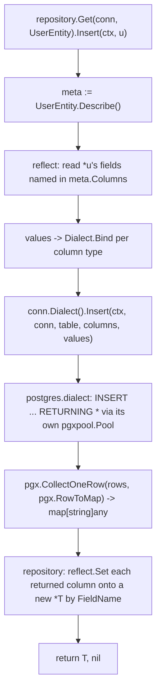

# Repository Core CRUD (M3, scoped) Design

**Spec**: `.specs/features/repository-core-crud/spec.md`
**Status**: Approved

---

## Architecture Overview

`Repository[T]` builds parameterized SQL directly from `entity.EntityMeta` (no `internal/plan` AST — see Tech Decisions for why this scoped pass diverges from AD-016) and calls two new `golem.Dialect` methods that do the actual execution: `Insert` and `FindByID`. The Postgres implementation of these methods holds a direct reference to its own `*pgxpool.Pool` (stored on `connector.Connect()`'s returned `dialect` value, which until now was a stateless stub) and uses `pgx.CollectOneRow(rows, pgx.RowToMap)` to scan the result straight into `map[string]any` — `Repository[T]` then uses `reflect` to write those column values back onto struct fields by name (the same `FieldName` recorded in `entity.EntityMeta`).



---

## Why this pass diverges from AD-016 (`internal/plan` + asymmetric Compile/Execute contract)

AD-016 (recorded in STATE.md, ported from the original design) anticipated an internal AST (`plan.Select`/`Insert`/`Update`/`Delete`) so a future query builder (M4: arbitrary predicates, M6: joins) and multi-dialect round-trip differences (Postgres `RETURNING` vs. MySQL's lack of it) have a shared representation to grow into. **None of that is needed yet**: this pass has no query builder, one dialect, and exactly two operations (`Insert`, `FindByID`) with fixed, simple shapes (all-columns insert; single-column PK lookup). Building the AST now would be speculative infrastructure for capabilities that don't exist — the same YAGNI principle already applied to `Unique`/`Index`/`relation.ForeignKeyOptions` in this pass.

**This is not a reversal of AD-016** — it's deferred exactly like the AST's own original scoping note ("`plan.*` grows incrementally per milestone... not fully speced upfront"). When M4 (query builder) actually needs arbitrary predicates, `internal/plan` gets built then, and `Dialect.Insert`/`FindByID` from this pass either get subsumed into the AST-based contract or coexist as the simple-case fast path. Recorded as AD-020 in STATE.md.

---

## Components

### `golem.Dialect` grows two methods (modifies M1's `dialect.go`)

```go
// added to the existing Dialect interface in dialect.go
Insert(ctx context.Context, conn Conn, table string, columns []string, values []driver.Value) (map[string]any, error)
FindByID(ctx context.Context, conn Conn, table string, pkColumn string, id driver.Value) (map[string]any, bool, error)
```

`conn Conn` is accepted for signature future-proofing (M8 transactions will need to route through the transaction's connection instead of the adapter's own pool) but is UNUSED by the Postgres implementation in this pass — it always uses its own stored pool. This is fine in Go (an unused named parameter is not a vet error) and is called out with a `// TODO(M8)` comment, not silently ignored without a trace.

`FindByID`'s `bool` return is "found" — `false` with a nil error means no matching row (`sql.ErrNoRows`/`pgx.ErrNoRows` equivalent), letting `repository.FindByID` translate that into `golem.ErrNotFound` without the `Dialect` needing to know about ORM-level sentinel errors.

### `golem.Conn` grows one exported method (modifies M1's `conn.go` + `datasource.go`)

```go
// conn.go
type Conn interface {
    isConn()
    Dialect() Dialect // NEW — the mechanism FOUND-18 always intended M3 to add
}
```

```go
// datasource.go
func (ds *DataSource) Dialect() Dialect { return ds.dialect }
```

This is the exact, intended evolution FOUND-11/FOUND-18 (M1 spec) called for: `Conn` had zero speculative methods until a real caller (this task) needed one. Recorded as AD-019 in STATE.md.

### `golem.ErrNotFound` (introduced early, ahead of full M10)

```go
// errors.go (new file)
var ErrNotFound = errors.New("golem: not found")
```

M10 will add `ErrDuplicateKey`/`ErrForeignKeyViolation` and SQLSTATE-based mapping later; this pass only needs the one sentinel `FindByID` requires (spec.md AC-5).

### Postgres `dialect` gains state + the two new methods (modifies M1's `dialect.go` stub and `connector.go`)

- **Location**: `adapter/postgres/dialect.go` (modify), `adapter/postgres/connector.go` (modify: `Connect()` now returns `&dialect{pool: pool}` instead of the stateless `&dialect{}`)
- `Insert`: builds `INSERT INTO "table" ("col1","col2") VALUES ($1,$2) RETURNING *`, runs via `d.pool.Query(ctx, sql, values...)`, scans with `pgx.CollectOneRow(rows, pgx.RowToMap)`.
- `FindByID`: builds `SELECT * FROM "table" WHERE "pkColumn" = $1`, runs via `d.pool.Query`, scans with `pgx.CollectOneRow`; on `pgx.ErrNoRows`, returns `(nil, false, nil)`.
- `Bind`/`Scan` (existing M1 stub methods) stay as descriptive-error stubs — this pass's `Insert`/`FindByID` don't route individual values through `Bind`/`Scan` (they pass Go values straight to `pgx`, which already knows how to marshal `int64`/`string`/etc. natively; `Bind`/`Scan`'s real job — UUID/JSONB/exotic types — starts once `golem.ColumnType` grows those in a later M2 continuation). Noted as a scoped simplification, not a silent gap: `Bind`/`Scan` remain in the interface and still get exercised by their own M1 unit tests.

### `repository.Repository[T]` + `repository.Get[T]`

- **Location**: `repository/repository.go`
- **Interfaces**:
  - `func Get[T any](conn golem.Conn, e *entity.Entity[T]) *Repository[T]`
  - `(*Repository[T]) Insert(ctx context.Context, i *T) (T, error)`
  - `(*Repository[T]) InsertMany(ctx context.Context, items ...*T) ([]T, error)` — N sequential `Insert` calls
  - `(*Repository[T]) FindByID(ctx context.Context, id any) (T, error)` — requires `len(meta.PrimaryKey) == 1`, returns a wrapped error otherwise (not `golem.ErrNotFound` — this is a caller-usage error, distinct from "no row found")
- **Reads/writes struct fields via `reflect.ValueOf(i).Elem().FieldByName(col.FieldName)`** — `Set`/`Interface()` as needed. `T` is always a struct (enforced implicitly: `entity.New[T]` requires a struct with addressable fields for the offset trick to have worked in the first place).
- **Dependencies**: `entity.EntityMeta`, `golem.Dialect`, `golem.Conn`, `golem.ErrNotFound`

---

## Data Flow: `Insert`

1. `meta := e.Describe()`
2. For each `col := range meta.Columns`: read `reflect.ValueOf(i).Elem().FieldByName(col.FieldName).Interface()` → build `columns []string`, `values []driver.Value` (raw Go values; no `Dialect.Bind` call in this pass per the simplification above — driver values here are just the underlying Go values, `pgx` accepts them natively)
3. `row, err := conn.Dialect().Insert(ctx, conn, meta.TableName, columns, values)`
4. Build a new `T`; for each key in the returned `row map[string]any`, find the matching `col` by `col.Name == key`, `reflect`-set `FieldByName(col.FieldName)` (type-asserting/converting `pgx`'s returned Go type to the field's type — e.g. `int64` from a `bigint` column into an `int64` field works directly; documented as "same-shape Go types only" for this pass, real `Dialect.Scan`-driven conversion is a later continuation)
5. Return the populated `T`

## Data Flow: `FindByID`

1. `meta := e.Describe()`; if `len(meta.PrimaryKey) != 1`, return a descriptive error (composite-PK `FindByID` out of scope)
2. `row, found, err := conn.Dialect().FindByID(ctx, conn, meta.TableName, meta.PrimaryKey[0], id)`
3. If `!found`, return `golem.ErrNotFound`
4. Same reflect-populate step as `Insert`'s step 4

---

## Bootstrapping the example's schema (DDL — out of golem's own scope per AD-012)

`golem` never generates DDL. `examples/postgres-minimal-blog` needs real tables (`users`, `post`, `category`, `post_to_category`) with FK constraints before it can run. Since `docker-compose.test.yml`'s Postgres service has no persistent volume (fresh container every `up`/`down` cycle), a SQL file mounted at `/docker-entrypoint-initdb.d/` runs automatically on first container init — idiomatic Postgres-in-Docker bootstrapping, zero code in `golem` or the example needed to create tables.

- **New file**: `testdata/schema.sql` (repo root) — `CREATE TABLE` statements for all M2/M3 integration tests AND the example to share.
- **`docker-compose.test.yml` modification**: add a volume mount `./testdata/schema.sql:/docker-entrypoint-initdb.d/schema.sql:ro` to the existing `postgres` service.
- All column names in `schema.sql` are plain lowercase/snake_case (`owner_user_id`, etc.) — matching exactly what `entity.Builder`'s naming rules (schema-declaration/design.md) will generate, since SQL generation always double-quotes the stored name string verbatim.

---

## Tech Decisions

| Decision | Choice | Rationale |
| --- | --- | --- |
| No `internal/plan` AST this pass | Direct SQL string building in `Dialect.Insert`/`FindByID` | No query builder exists yet to justify an AST (YAGNI) — see "Why this pass diverges from AD-016" above |
| `Conn` gains `Dialect() Dialect` | Exported method added now | FOUND-11/18 (M1) explicitly anticipated this exact growth moment; `repository` (external package) has no other way to reach the active `Dialect` |
| `golem.ErrNotFound` introduced ahead of M10 | One sentinel, in a new `errors.go` | `FindByID` cannot signal "no row" any other way without string-matching driver errors, which the project explicitly rejects elsewhere (see Errors section of README) |
| Values passed to `pgx` without going through `Dialect.Bind` | Direct native Go values | `Bind`'s real job (UUID/JSONB/exotic types) isn't exercised by `BIGINT`/`VARCHAR`/`TEXT` — pgx already marshals these natively; wiring `Bind` through now would just call a stub that always errors |
| `InsertMany` = N×`Insert` | No batched multi-row `INSERT` | Spec's own Out of Scope — optimize only when there's a real multi-row perf need |
| Schema bootstrap via Docker `initdb.d`, not golem code | `testdata/schema.sql` | Matches AD-012 (migrations are always external to `golem`) — the example needs tables to exist, but golem itself must never be the thing that creates them |
